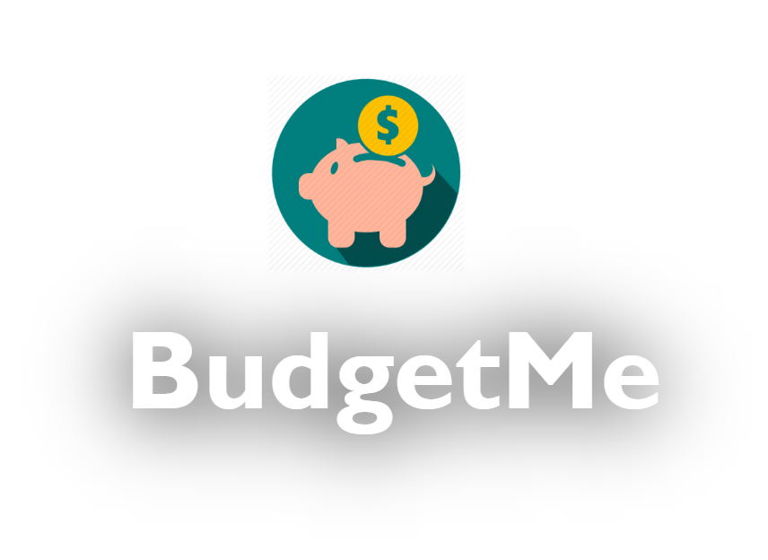

# BudgetMe

[BudgetMe](https://gogos-budgetme.herokuapp.com/)

## PWA App for budgeting/spending

  

Dashboard where a user can see how much they have spent in different categories that will use a receipt image or e-receipt

## Built With

* [React](https://reactjs.org/) - Front-end library
* [Redux](https://redux.js.org/) - State Management
* [Express](https://expressjs.com/) -Routing/backend
* [PostgreSQL](https://www.postgresql.org/) - Database
* [Sequelize](http://docs.sequelizejs.com/) - ORM
* [Google Cloud Vision API](https://cloud.google.com/vision/docs/) -OCR

### Tech stack

* NERDS stack
* PWA
* D3.js

### MVP

* Users can take/upload a picture of a receipt through the app
* The app will detect the text on the receipt and parse out each item name and total
* User selects items/all and assigns them to categories
* We provide default categories in dropdown list that user can add to

## Authors

* **Linwei Liu** - [https://github.com/orgs/The-Go-Gos/people/llwsgr](https://github.com/orgs/The-Go-Gos/people/llwsgr)
* **Naomi Moreira** - [https://github.com/Naomoreira](https://github.com/Naomoreira)
* **Yunshu Xiao** - [https://github.com/TechGirl-Yunshu](https://github.com/TechGirl-Yunshu)

### Stretch Goals

* Data visualization of monthly spending per category
* User can input overall budget for month - app notifies them when:
  Approaching
  Meeting
  Exceeding
* User can add customized category to the NavBar on dashboard page(add a column in category db)
